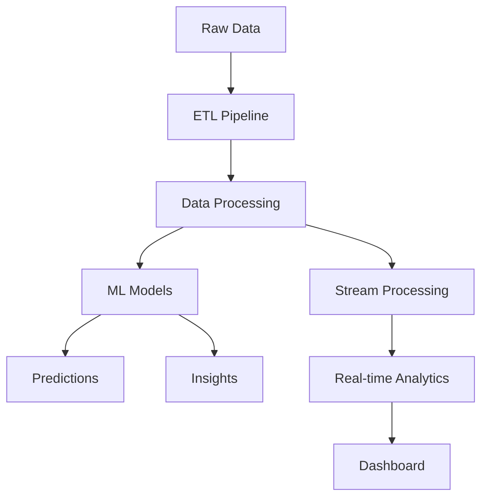
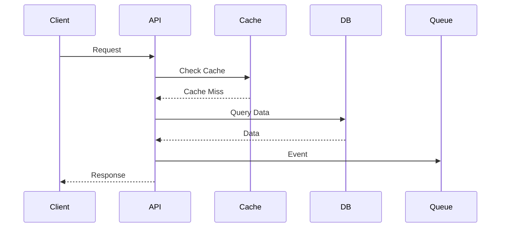

# 404 ENTERPRISE System Architecture

## Overview
404 ENTERPRISE uses a microservices architecture with event-driven communication between its core modules: Stock Management, HR Management, and Accounting.

## Service Components

### Auth Service
- JWT token management
- WebAuthn implementation
- Rate limiting
- Session management

### Analytics Service


### Data Flow


# 404 ENTERPRISE Architecture Documentation

## System Overview

404 ENTERPRISE is a comprehensive business management system designed for Algerian businesses, with integrated modules for Stock Management, HR Management, and Accounting. The system uses Algerian Dinar (DZD) as the default currency throughout all financial operations.

### Authentication System
- Username-based authentication
- Role-based access control
- JWT token management
- Session handling

### User Management
- User registration
- User authorization
- Role management
- Permission control

## Core Modules

### Stock Management Module
- Inventory tracking
- Stock movements
- Purchase orders
- Supplier management
- Low stock alerts

### HR Management Module
- Employee records
- Department management
- Position tracking
- Leave requests
- Performance reviews

### Accounting Module
- Invoices and billing
- Proforma invoices
- Contracts management
- Journal entries
- Chart of accounts
- Financial statements

## Components

### User Module
```typescript
interface UserModule {
  // User Model
  model: {
    username: string;
    password: string;
    role: string;
    isAuthorized: boolean;
    permissions: string[];
    settings: UserSettings;
  };

  // Authentication
  auth: {
    login: (username: string, password: string) => Promise<AuthResponse>;
    register: (userData: UserData) => Promise<User>;
    authorize: (userId: string) => Promise<User>;
  };

  // User Management
  management: {
    getUsers: () => Promise<User[]>;
    getUser: (id: string) => Promise<User>;
    updateUser: (id: string, data: UserData) => Promise<User>;
    deleteUser: (id: string) => Promise<void>;
  };
}
```

### Authentication Flow
1. User Registration
   - Validate username format
   - Check username uniqueness
   - Hash password
   - Create user record
   - Set isAuthorized to false

2. Admin Authorization
   - Admin reviews user
   - Updates isAuthorized
   - Sets permissions
   - Notifies user

3. User Login
   - Validate credentials
   - Check authorization
   - Generate JWT
   - Update last login
   - Return user data

## Security

### Authentication Security
- Username validation
- Password hashing
- JWT encryption
- Session management

### Authorization Security
- Role-based access
- Permission checks
- Resource protection
- Audit logging

## Data Flow

### User Data
1. Registration
   ```
   Client -> API -> Validation -> Database
   ```

2. Authorization
   ```
   Admin -> API -> Validation -> Database -> Notification
   ```

3. Authentication
   ```
   Client -> API -> Validation -> Database -> JWT -> Client
   ```

## Integration

### API Integration
```typescript
interface AuthAPI {
  // Public endpoints
  register: '/api/v1/users/register';
  login: '/api/v1/users/login';

  // Protected endpoints
  profile: '/api/v1/users/profile';
  updateProfile: '/api/v1/users/profile';

  // Admin endpoints
  getUsers: '/api/v1/users';
  getUser: '/api/v1/users/:id';
  createUser: '/api/v1/users';
  updateUser: '/api/v1/users/:id';
  deleteUser: '/api/v1/users/:id';
  authorizeUser: '/api/v1/users/:id/authorize';
}
```

### Database Integration
```typescript
interface DatabaseIntegration {
  // User operations
  createUser: (userData: UserData) => Promise<User>;
  findUser: (username: string) => Promise<User>;
  updateUser: (id: string, data: UserData) => Promise<User>;
  deleteUser: (id: string) => Promise<void>;

  // Authorization
  authorizeUser: (id: string) => Promise<User>;
  getAuthorizedUsers: () => Promise<User[]>;
}
```

## Scalability

### Horizontal Scaling
- Load balancing
- Session sharing
- Database replication
- Cache distribution

### Vertical Scaling
- Resource optimization
- Query optimization
- Index management
- Connection pooling

## Monitoring

### System Monitoring
- Performance metrics
- Error tracking
- User activity
- Security events

### Health Checks
- API status
- Database connection
- Authentication service
- Authorization service

## Best Practices

### Development
- Code organization
- Error handling
- Testing strategy
- Documentation

### Security
- Input validation
- Data protection
- Access control
- Regular audits

### Performance
- Query optimization
- Caching strategy
- Resource management
- Load balancing
