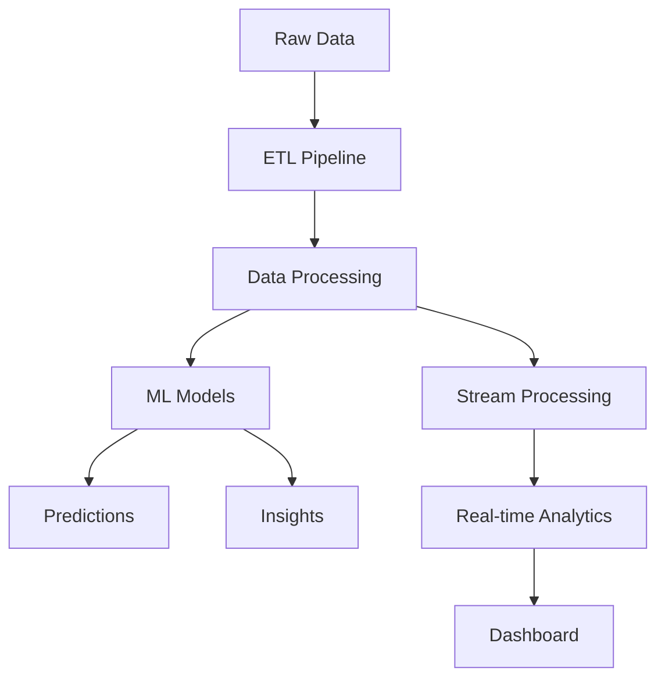
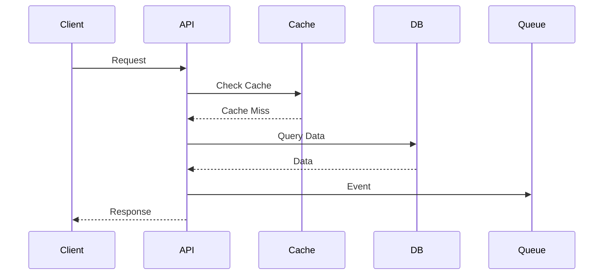

# System Architecture

## Overview
Stock HR uses a microservices architecture with event-driven communication.

## Service Components

### Auth Service
- JWT token management
- WebAuthn implementation
- Rate limiting
- Session management

### Analytics Service

### Data Flow

