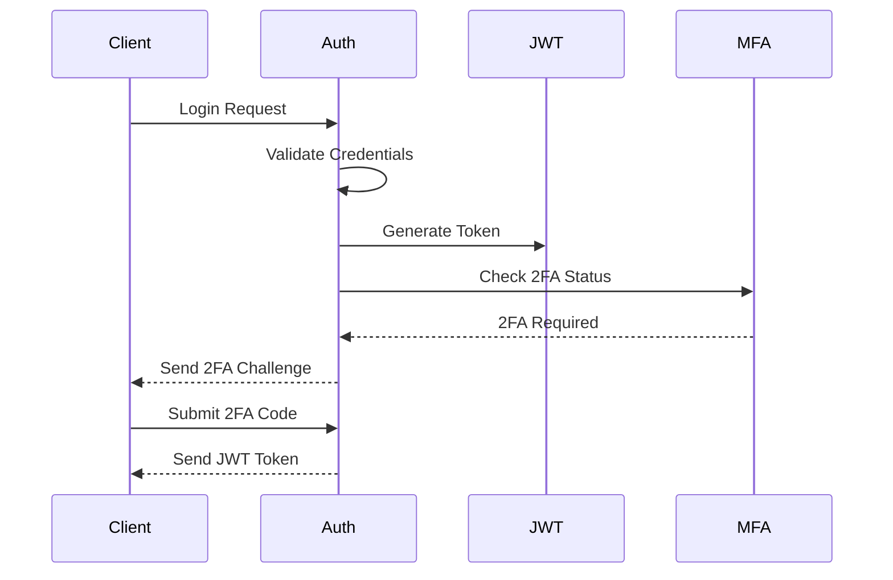

# Security Implementation Guide

## Authentication Flow


## Security Measures
1. Password Requirements
   - Minimum 12 characters
   - Mix of uppercase, lowercase, numbers, symbols
   - Bcrypt with salt rounds = 12

2. Rate Limiting
   ```typescript
   {
     windowMs: 15 * 60 * 1000,
     max: 100,
     message: 'Too many requests'
   }
   ```

3. Session Management
   - JWT expiry: 15 minutes
   - Refresh token: 7 days
   - Rotation on each use
