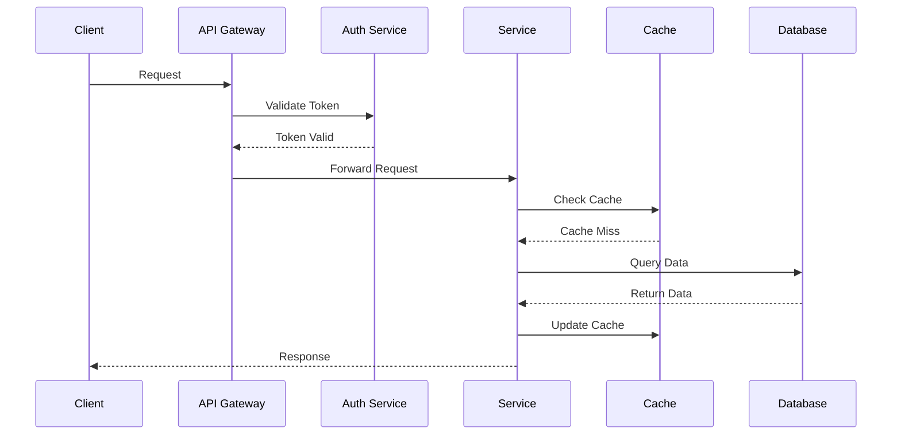

# Technical Documentation

## Architecture Overview

### System Components
- Frontend: React 18 + TypeScript
- Backend: Node.js + Express + TypeScript
- Database: MongoDB + Mongoose
- Cache: Redis
- Message Queue: RabbitMQ
- Authentication: JWT + WebAuthn

### Data Flow

### Security Architecture
1. Authentication Flow
   - Password Hash: bcrypt (cost factor 12)
   - Token: JWT (RS256, 15min expiry)
   - Refresh Token: (7 days expiry)
   - Rate Limiting: 100 requests/15min

2. Authorization
   - RBAC (Role-Based Access Control)
   - Resource-level permissions
   - Action-based policies

3. Data Security
   - AES-256-GCM encryption at rest
   - TLS 1.3 in transit
   - Regular security audits
