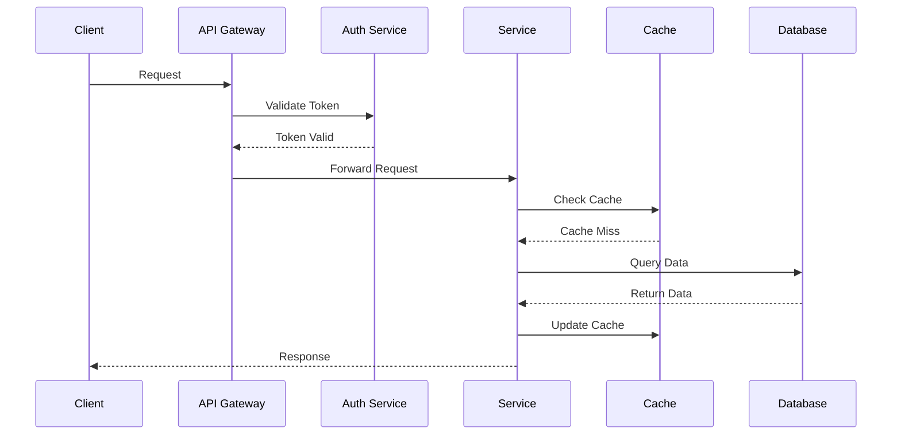

# 404 ENTERPRISE Technical Documentation

## 404 ENTERPRISE Architecture Overview

### System Components
- Frontend: React 18 + TypeScript
- Backend: Node.js + Express + TypeScript
- Database: MongoDB + Mongoose
- Cache: Redis
- Message Queue: RabbitMQ
- Authentication: JWT + WebAuthn

### Data Flow


### Security Architecture
1. Authentication Flow
   - Password Hash: bcrypt (cost factor 12)
   - Token: JWT (RS256, 15min expiry)
   - Refresh Token: (7 days expiry)
   - Rate Limiting: 100 requests/15min

2. Authorization
   - RBAC (Role-Based Access Control)
   - Resource-level permissions
   - Action-based policies

3. Data Security
   - AES-256-GCM encryption at rest
   - TLS 1.3 in transit
   - Regular security audits

## Authentication System

### Username Format
```typescript
type UsernameFormat = {
  superadmin: 'SA' + number;  // SA00000
  admin: 'UA' + number;       // UA00001
  user: 'U' + number;         // U00002
};

const usernameRegex = /^(SA|UA|U)\d{5}$/;
```

### Password Requirements
```typescript
interface PasswordRequirements {
  minLength: 8;
  requireNumbers: true;
  requireLowercase: true;
  requireUppercase: true;
  requireSpecialChars: true;
}

const passwordRegex = /^(?=.*[a-z])(?=.*[A-Z])(?=.*\d)(?=.*[@$!%*?&])[A-Za-z\d@$!%*?&]{8,}$/;
```

## API Endpoints

### Authentication Endpoints
```typescript
interface AuthEndpoints {
  // Public endpoints
  register: {
    method: 'POST';
    path: '/api/v1/users/register';
    body: {
      username: string;
      password: string;
      role?: 'user';
    };
  };

  login: {
    method: 'POST';
    path: '/api/v1/users/login';
    body: {
      username: string;
      password: string;
    };
  };

  // Protected endpoints
  profile: {
    method: 'GET';
    path: '/api/v1/users/profile';
    headers: {
      Authorization: string;
    };
  };

  updateProfile: {
    method: 'PATCH';
    path: '/api/v1/users/profile';
    headers: {
      Authorization: string;
    };
    body: {
      firstName?: string;
      lastName?: string;
      settings?: UserSettings;
    };
  };

  // Admin endpoints
  getUsers: {
    method: 'GET';
    path: '/api/v1/users';
    headers: {
      Authorization: string;
    };
    query: {
      role?: string;
      isAuthorized?: boolean;
    };
  };

  authorizeUser: {
    method: 'PATCH';
    path: '/api/v1/users/:id/authorize';
    headers: {
      Authorization: string;
    };
    params: {
      id: string;
    };
  };
}
```

## Database Schema

### User Collection
```typescript
interface UserDocument {
  _id: mongoose.Types.ObjectId;
  username: string;
  password: string;
  role: 'superadmin' | 'admin' | 'user';
  isAuthorized: boolean;
  firstName?: string;
  lastName?: string;
  permissions: string[];
  settings: {
    theme: 'light' | 'dark';
    language: string;
    notifications: boolean;
  };
  lastLogin?: Date;
  createdAt: Date;
  updatedAt: Date;
}
```

## Security Implementation

### Password Hashing
```typescript
const hashPassword = async (password: string): Promise<string> => {
  const salt = await bcrypt.genSalt(12);
  return bcrypt.hash(password, salt);
};

const comparePassword = async (password: string, hash: string): Promise<boolean> => {
  return bcrypt.compare(password, hash);
};
```

### JWT Implementation
```typescript
const generateToken = (userId: string): string => {
  return jwt.sign(
    { id: userId },
    process.env.JWT_SECRET,
    { expiresIn: process.env.JWT_EXPIRES_IN }
  );
};

const verifyToken = (token: string): JwtPayload => {
  return jwt.verify(token, process.env.JWT_SECRET) as JwtPayload;
};
```

## Error Handling

### Custom Errors
```typescript
class AppError extends Error {
  constructor(
    public statusCode: number,
    public message: string,
    public isOperational = true
  ) {
    super(message);
    Object.setPrototypeOf(this, AppError.prototype);
  }
}

// Authentication errors
class AuthError extends AppError {
  constructor(message: string) {
    super(401, message);
  }
}

// Validation errors
class ValidationError extends AppError {
  constructor(message: string) {
    super(400, message);
  }
}
```

## Testing

### Authentication Tests
```typescript
describe('Authentication', () => {
  test('should register user with valid username', async () => {
    const userData = {
      username: 'U00001',
      password: 'Test@123'
    };
    const response = await registerUser(userData);
    expect(response.status).toBe(201);
  });

  test('should login with valid credentials', async () => {
    const credentials = {
      username: 'U00001',
      password: 'Test@123'
    };
    const response = await loginUser(credentials);
    expect(response.status).toBe(200);
    expect(response.body.token).toBeDefined();
  });

  test('should not login with invalid credentials', async () => {
    const credentials = {
      username: 'U00001',
      password: 'Wrong@123'
    };
    const response = await loginUser(credentials);
    expect(response.status).toBe(401);
  });
});
```

## Performance Optimization

### Database Indexes
```typescript
// User collection indexes
userSchema.index({ username: 1 }, { unique: true });
userSchema.index({ role: 1 });
userSchema.index({ isAuthorized: 1 });
userSchema.index({ createdAt: 1 });
```

### Query Optimization
```typescript
// Optimized user queries
const findUser = async (username: string): Promise<UserDocument | null> => {
  return User.findOne({ username })
    .select('+password')
    .lean();
};

const getAuthorizedUsers = async (): Promise<UserDocument[]> => {
  return User.find({ isAuthorized: true })
    .select('-password')
    .lean();
};
```

## Monitoring

### Logging
```typescript
interface LogEntry {
  timestamp: Date;
  level: 'info' | 'warn' | 'error';
  message: string;
  metadata?: Record<string, any>;
}

const logAuthEvent = (event: string, metadata?: Record<string, any>): void => {
  logger.info({
    timestamp: new Date(),
    level: 'info',
    message: `Auth event: ${event}`,
    metadata
  });
};
```

## Best Practices

### Code Organization
- Modular structure
- Clear separation of concerns
- Consistent naming conventions
- Comprehensive documentation

### Security
- Input validation
- Password hashing
- JWT implementation
- Access control

### Performance
- Database indexing
- Query optimization
- Caching strategy
- Resource management

## Currency Handling

### Algerian Dinar (DZD) Implementation
```typescript
interface CurrencyConfig {
  code: 'DZD';
  symbol: 'DA';
  locale: 'fr-DZ';
  precision: 2;
}

const formatCurrency = (amount: number): string => {
  return new Intl.NumberFormat('fr-DZ', {
    style: 'currency',
    currency: 'DZD',
  }).format(amount);
};

const parseCurrency = (value: string): number => {
  // Remove currency symbol and non-numeric characters except decimal point
  const numericValue = value.replace(/[^0-9.]/g, '');
  return parseFloat(numericValue);
};
```
