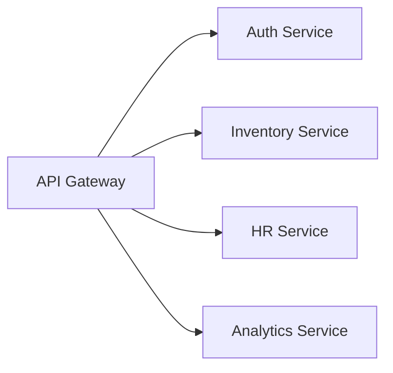
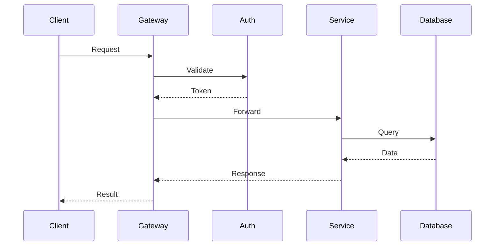
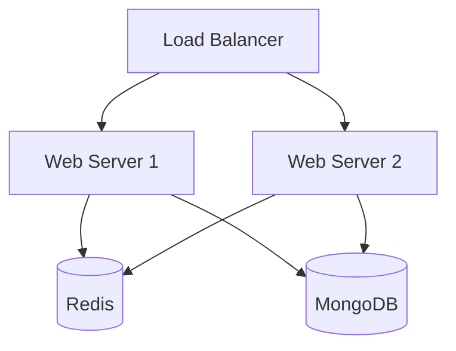

# System Architecture

## Overview

Stock & HR Management System follows a microservices-based architecture with the following key components:

### Core Services

## Service Details

### API Gateway
- Rate limiting
- Request validation
- Authentication
- Load balancing
- Request routing

### Auth Service
- User management
- Role-based access control
- Session management
- Security audit
- MFA handling

### Inventory Service
- Stock management
- Order processing
- Inventory tracking
- Supplier management
- Stock analytics

### HR Service
- Employee management
- Performance tracking
- Leave management
- Training records
- Payroll integration

### Analytics Service
- Real-time metrics
- AI predictions
- Report generation
- Data visualization
- KPI tracking

## Data Flow

## Security Architecture

### Authentication Flow
1. Password-based authentication
2. Hardware key validation
3. MFA verification
4. Session token generation
5. Refresh token rotation

### Data Protection
- End-to-end encryption
- At-rest encryption
- Data masking
- Audit logging
- Access control

## Deployment Architecture

