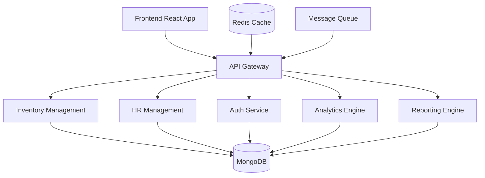

# Stock & HR Management System

A comprehensive management system for handling inventory, human resources, and business operations in compliance with Algerian regulations.

## Features

- 📦 Inventory Management
- 👥 Human Resources Management
- 📄 Contract Management
- 💰 Invoice Management
- 🌐 Multi-language Support (English, French, Arabic)
- 📱 Responsive Design
- 🔒 Secure Authentication
- 📊 Dashboard Analytics
- 🎯 Performance Analytics & AI Insights
- 🏆 Gamification & Team Engagement
- 📈 Advanced KPI Tracking
- 🤝 Team Collaboration Tools
- 📱 Progressive Web App (PWA)
- 🔄 Real-time Updates
- 🎨 Customizable Dashboards
- 🤖 Automated Reporting

## System Architecture



## Prerequisites

Before you begin, ensure you have the following installed:
- Node.js (v14 or higher)
- npm (v6 or higher)
- MongoDB (v4.4 or higher)
- Git

## Complete Installation Guide

### Prerequisites Setup

1. Install Node.js:
   ```bash
   # Using nvm (recommended)
   curl -o- https://raw.githubusercontent.com/nvm-sh/nvm/v0.39.0/install.sh | bash
   nvm install 14
   nvm use 14
   
   # Verify installation
   node --version
   npm --version
   ```

2. Install MongoDB:
   ```bash
   # Ubuntu
   wget -qO - https://www.mongodb.org/static/pgp/server-4.4.asc | sudo apt-key add -
   echo "deb [ arch=amd64,arm64 ] https://repo.mongodb.org/apt/ubuntu focal/mongodb-org/4.4 multiverse" | sudo tee /etc/apt/sources.list.d/mongodb-org-4.4.list
   sudo apt-get update
   sudo apt-get install -y mongodb-org
   
   # Start MongoDB
   sudo systemctl start mongod
   sudo systemctl enable mongod
   
   # Verify MongoDB
   mongo --eval 'db.runCommand({ connectionStatus: 1 })'
   ```

3. Install Redis (Optional - for caching):
   ```bash
   sudo apt-get install redis-server
   sudo systemctl start redis
   sudo systemctl enable redis
   
   # Verify Redis
   redis-cli ping
   ```

### Project Setup

1. Create project directory:
   ```bash
   mkdir /opt/stockhr
   cd /opt/stockhr
   ```

2. Clone and setup repository:
   ```bash
   # Clone repository
   git clone https://github.com/yourusername/stock-hr-management.git .
   
   # Create necessary directories
   mkdir -p storage/uploads
   mkdir -p logs
   ```

### Backend Configuration

1. Backend setup:
   ```bash
   cd backend
   
   # Install dependencies
   npm install
   
   # Setup environment
   cp .env.example .env
   
   # Generate secure keys
   echo "JWT_SECRET=$(openssl rand -base64 32)" >> .env
   echo "ENCRYPTION_KEY=$(openssl rand -base64 32)" >> .env
   
   # Configure database
   echo "MONGODB_URI=mongodb://localhost:27017/stockhr" >> .env
   
   # Build TypeScript
   npm run build
   ```

2. Initialize database:
   ```bash
   # Create superadmin
   npm run create-admin
   
   # Seed initial data
   npm run seed
   ```

### Frontend Configuration

1. Frontend setup:
   ```bash
   cd ../frontend
   
   # Install dependencies
   npm install
   
   # Setup environment
   cp .env.example .env
   
   # Configure API URL
   echo "REACT_APP_API_URL=http://localhost:5000/api" >> .env
   
   # Build production assets
   npm run build
   ```

### System Configuration

1. Configure Nginx:
   ```bash
   sudo apt-get install nginx
   sudo cp deployment/nginx/stockhr.conf /etc/nginx/sites-available/
   sudo ln -s /etc/nginx/sites-available/stockhr.conf /etc/nginx/sites-enabled/
   sudo nginx -t
   sudo systemctl restart nginx
   ```

2. Setup PM2 process manager:
   ```bash
   npm install -g pm2
   
   # Start backend
   cd backend
   pm2 start ecosystem.config.js
   
   # Save PM2 configuration
   pm2 save
   pm2 startup
   ```

### Verification Steps

1. Check services:
   ```bash
   # Check MongoDB
   sudo systemctl status mongod
   
   # Check Redis
   sudo systemctl status redis
   
   # Check API
   curl http://localhost:5000/api/health
   
   # Check PM2 processes
   pm2 status
   ```

2. Access application:
   - Frontend: http://localhost:3000
   - API: http://localhost:5000/api
   - Swagger docs: http://localhost:5000/api-docs

### Troubleshooting

1. Service issues:
   ```bash
   # Check logs
   pm2 logs
   sudo journalctl -u mongod
   sudo journalctl -u redis
   
   # Reset services
   pm2 restart all
   sudo systemctl restart mongod
   sudo systemctl restart redis
   ```

2. Permission issues:
   ```bash
   # Fix uploads directory
   sudo chown -R nodejs:nodejs /opt/stockhr/storage
   sudo chmod 755 /opt/stockhr/storage
   ```

3. Database issues:
   ```bash
   # Reset database
   mongo stockhr --eval "db.dropDatabase()"
   npm run seed
   ```

## Complete Installation Guide for Beginners

### Windows Setup

1. Install Node.js:
   - Visit https://nodejs.org
   - Download the LTS (Long Term Support) version
   - Run the installer
   - Check "Automatically install necessary tools"
   - Click through the installer (Next > Next > Install)
   - To verify installation:
     - Open Command Prompt (Win + R, type "cmd", press Enter)
     - Type: `node --version`
     - Type: `npm --version`
   - Add to PATH if needed:
     - Open System Properties (Win + R, type "sysdm.cpl", press Enter)
     - Click "Environment Variables"
     - Under "System variables", find "Path"
     - Click "Edit" > "New"
     - Add: `C:\Program Files\nodejs`
     - Click OK on all windows

2. Install Git:
   - Visit https://git-scm.com/download/win
   - Download Windows version
   - Run installer
   - Use default options (Next > Next > Install)
   - To verify:
     - Open new Command Prompt
     - Type: `git --version`

3. Install MongoDB:
   - Visit https://www.mongodb.com/try/download/community
   - Download MSI installer
   - Run installer
   - Choose "Complete" installation
   - Check "Install MongoDB as a Service"
   - Check "Run service as Network Service user"
   - Click Install
   - To verify:
     - Open new Command Prompt
     - Type: `mongod --version`

4. Install Visual Studio Code (Recommended):
   - Visit https://code.visualstudio.com
   - Download Windows version
   - Run installer
   - Check all options during installation
   - Recommended extensions:
     - ESLint
     - Prettier
     - GitLens
     - MongoDB for VS Code

### Project Setup (Windows)

1. Create Project Directory:
   - Open Command Prompt as Administrator
   - Run these commands:
   ```bash
   cd C:\
   mkdir Stock_HR
   cd Stock_HR
   ```

2. Clone Project:
   ```bash
   git clone https://github.com/yourusername/stock-hr-management.git .
   ```

3. Configure Backend:
   ```bash
   cd backend
   npm install

   # Create .env file
   echo PORT=5000 > .env
   echo MONGODB_URI=mongodb://localhost:27017/stockhr >> .env
   echo JWT_SECRET=your_secret_key >> .env
   ```

4. Configure Frontend:
   ```bash
   cd ../frontend
   npm install

   # Create .env file
   echo REACT_APP_API_URL=http://localhost:5000/api > .env
   ```

### First Time Setup

1. Initialize Database:
   - Open Command Prompt as Administrator
   - Start MongoDB:
   ```bash
   net start MongoDB
   ```
   
2. Create Admin User:
   ```bash
   cd C:\Stock_HR\backend
   npm run create-admin
   ```
   - Default login:
     - Email: admin@stockhr.com
     - Password: Admin123!

3. Start Development Servers:
   - Open two Command Prompt windows
   - In first window:
   ```bash
   cd C:\Stock_HR\backend
   npm run dev
   ```
   - In second window:
   ```bash
   cd C:\Stock_HR\frontend
   npm start
   ```

4. Access Application:
   - Open Chrome or Firefox
   - Visit: http://localhost:3000
   - Login with admin credentials

### Common Issues & Solutions

1. Node.js "not recognized":
   - Restart Command Prompt after installation
   - Check PATH variables
   - Try running as Administrator

2. MongoDB won't start:
   - Check Services (Win + R, type "services.msc")
   - Find MongoDB
   - Right-click > Start
   - If error, check logs in:
     `C:\Program Files\MongoDB\Server\4.4\log\`

3. Port Already in Use:
   - Open Command Prompt as Administrator
   - Find process:
   ```bash
   netstat -ano | findstr :5000
   ```
   - Kill process:
   ```bash
   taskkill /PID <process_id> /F
   ```

## Usage

1. Open your browser and navigate to `http://localhost:3000`
2. Log in with your credentials
3. Navigate through the dashboard and various modules

## Language Support

The application supports three languages:
- English (en)
- French (fr)
- Arabic (ar)

To change the language:
1. Click on the language selector in the top navigation bar
2. Select your preferred language
3. The interface will update automatically, including RTL support for Arabic

## Development

### Backend Development
```bash
cd backend
npm run dev
```

### Frontend Development
```bash
cd frontend
npm start
```

### Running Tests
```bash
# Backend tests
cd backend
npm test

# Frontend tests
cd frontend
npm test
```

## Project Structure

```
stock-hr-management/
├── backend/
│   ├── src/
│   │   ├── config/
│   │   ├── controllers/
│   │   ├── middleware/
│   │   ├── models/
│   │   ├── routes/
│   │   └── utils/
│   └── package.json
├── frontend/
│   ├── src/
│   │   ├── components/
│   │   ├── features/
│   │   ├── pages/
│   │   ├── services/
│   │   ├── utils/
│   │   └── locales/
│   └── package.json
└── README.md
```

## Advanced Features

### Analytics Engine
- AI-powered performance predictions
- Burnout risk assessment
- Team productivity analytics
- Skill matrix tracking
- Learning path recommendations

### Security Features
- Hardware key authentication
- Multi-factor authentication
- Session management
- Activity monitoring
- Automated security audits

### Integration Options
- REST API
- WebSocket real-time updates
- Webhook support
- CSV/Excel import/export
- PDF generation

## Roadmap

### Q2 2024
- [ ] AI-powered analytics dashboard
- [ ] Mobile app release
- [ ] Advanced reporting engine
- [ ] Team collaboration features

### Q3 2024
- [ ] Automated workflow engine
- [ ] Enhanced security features
- [ ] Integration marketplace
- [ ] Custom plugin support

### Q4 2024
- [ ] Machine learning predictions
- [ ] Advanced visualization tools
- [ ] Blockchain integration
- [ ] IoT device support

## Contributing

1. Fork the repository
2. Create your feature branch (`git checkout -b feature/AmazingFeature`)
3. Commit your changes (`git commit -m 'Add some AmazingFeature'`)
4. Push to the branch (`git push origin feature/AmazingFeature`)
5. Open a Pull Request

## License

This project is licensed under the MIT License - see the LICENSE file for details.

## Support

For support, please contact the development team or create an issue in the repository.